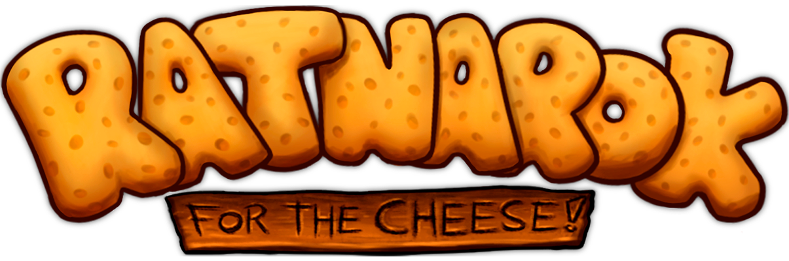

# Ratnarok: For The Cheese!

Ratnarok: For the Cheese! is a Top Down 3D Tower Defence in which you have to defend The Cheese from the enemy rats.
The Cheese is situated atop a small tower at the center of the level/map connected with different paths that surround it. 
You’ll have to place different turrets and structures
to defend yourself against the vicious enemies.

This is a game (still in development) developed by students from <a href="https://www.imagecampus.edu.ar/">Image Campus</a>

   

## Credits

- **Fermin Gimpel** - *Programming*
- **Ezequiel Bernales** - *Art*
- **Lautaro Cabrini** - *Art*
- **Leandro Tagliaferri Randazzo** - *Art*
- **Matías Viana** - *Art*
- **Rodrigo Arias Muñoz** - *Audio*
- **Ezequiel Baez** - *Audio*
- **Simón Blanco Schneebeli** - *Audio*
- **Ian Leguizamon** - *Audio*
- **Pedro Carbone** - *Testing*
- **Nicolás Fernandez Razzetto** - *Testing*
- **Ivan Rusch** - *Testing*
- **Cinthia Lorena Sabino** - *Testing*

This game was also possible thanks to the support of these professors:

- **Sergio Baretto**
- **Federico Barra**
- **Jorge Cuéllar**
- **Fernando Puig**
- **Eugenio Taboada**

## Links

Download it from itch.io: https://ezequiel-bernales.itch.io/ratnarok-for-the-cheese
